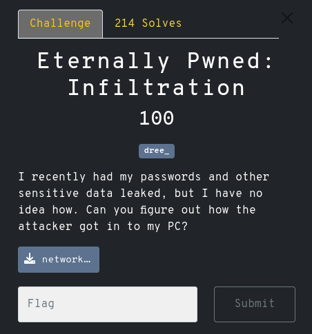

# Eternally Pwned: Exfiltration
#### Category: Forensics

 
###### The attached file is a .pcap, so we can analyze it using wireshark.

![[Pasted image 20240405223449.png]]

###### To get a nice summary of the traffic we look at `Statistics > Protocol Hierarchy`

![[Pasted image 20240405223636.png]]
![[Pasted image 20240405224247.png]]

###### Hmm... file sharing. Could find some secrets there!
###### We'll filter for only smb traffic.

![[Pasted image 20240405224359.png]]

###### That's a much more managable number of packets.

###### Clicking through each packet we see an interesting base64 looking string.

![[Screenshot from 2024-04-05 22-48-33.png]]

###### Decoding this we get the following: `wctf{l3tS_`
###### Definitely seems promising! Now to find the rest of it...

###### We can click on that packet and follow the TCP stream to find more.
![[Pasted image 20240405230325.png]]
![[Pasted image 20240405230036.png]]

###### By scrolling through the stream we can find two more pieces of base64.
###### Decoding these we get ```3teRn4lLy_g0_``` and ```bLU3_7n9wm4iWnL}```

###### We can combine these parts to get the full flag:
###### `wctf{l3tS_3teRn4lLy_g0_bLU3_7n9wm4iWnL}`
